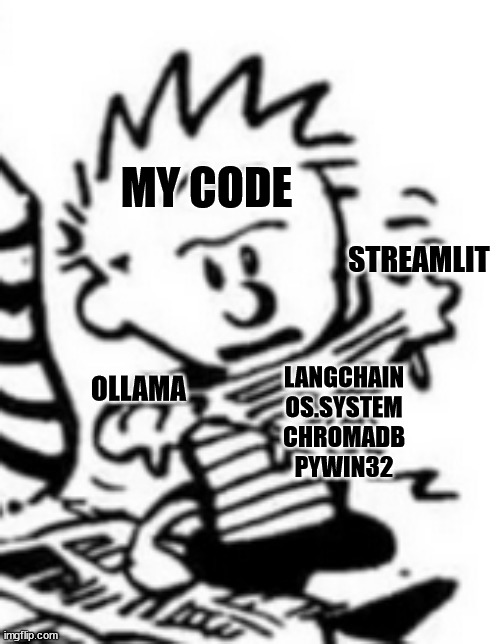

# Ollama LLM WebUI Integration

 
###### Or: A Hardware Engineer's Guide to Learning Large Language Models

## Introduction
This document details the process of developing a web-UI interface for interacting with a locally hosted LLM (gemma:2b). Provided below are the background, challenges and salient design decisions that accompanied the development process. Those interested in seeing a demonstration of the model can skip to the bottom, where a pair of links to videos are provided - the first has been edited to remove the long pauses where the machine is "thinking", while the second remains in uncut form to demonstrate the integrity of the model. All work completed for this project was done soley by myself (Cayton Larmer), made possible by extensive consultation of StackOverflow.

## Context and Problem Approach
It would be an understatement to say that working with large language models is outside the scope of my core competency; in fact, it would not be hyperbole to say that prior to starting on this project, *I had never directly interacted with a LLM at all*. However, my previous work with our university's robotics team has provided me with a great deal of practice engaging problems outside of my comfort zone. My first step was to address my total lack of context regarding work with LLMs - to this end, I found a comprehensive literature [See ref. 1], which provided a fantastic overview of the development of language models over the past decade. This, coupled with an excellent video series by 3blue1brown [Ref. 2] gave me enough theoretical appreciation to at least develop more intelligent questions for Googling.
Armed with a newfound foundation, the problem statement provided began to resolve itself into three distinct and coupled challenged:

- I needed to source a language model that my 2021 ideapad could stand to run, and familiarize myself with the API. Ollama seemed an attractive approach both because it was open-source and because the Python library seemed concise (it was only later I would discover how incomplete it was)

- Using this language model, I needed to build a toolchain that would let me perform Retrieval Augmented Generation (RAG) with the model. I swiftly pinned this as being the most technically challenging part of the problem, and set it aside to engage with later.

- Lastly, I needed to tie all of the ""backend"" work with the language model into a webUI. Speaking candidly, this was the task that scared me the most - I have no affinity for web development or user interface design, and thus did not have prior experience with any relevant tools. However, I do have a friend working in data science who vouched for Streamlit as being a very out-of-box toolkit. This was the primary driver behind my decision to use it.
